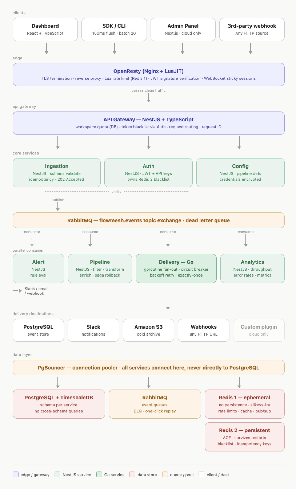

# FlowMesh

[](https://github.com/syedarifiqbal/flowmesh/actions/workflows/ci.yml)
[](https://opensource.org/licenses/MIT)
[](https://nodejs.org)
[](https://www.typescriptlang.org)
[](https://golang.org)
[](https://pnpm.io)
[](https://github.com/syedarifiqbal/flowmesh/pulls)

**Self-hostable, open-source real-time event pipeline platform.**

FlowMesh replaces Segment + Mixpanel + PagerDuty in a single Docker deployment — fully open source, fully under your control, free forever.

---

## The Problem

Every SaaS product needs to capture events, route them to multiple destinations, visualize them in real time, and alert the team when something goes wrong. Today that requires 4–6 paid tools and $2,000–$20,000/month.

FlowMesh does all of it, self-hosted, with one command:

```bash
docker compose up
```

---

## Who This Is For

- **Solo developers and startups** who cannot afford Segment or Mixpanel
- **Engineering teams** who want full data ownership with no third-party SaaS
- **DevOps teams** who need event observability without vendor lock-in
- **Regulated industries** where sending data to third-party tools is not an option

---

## What FlowMesh Is

Open source. Self-hosted. Free forever. No license keys. No feature flags. No artificial limits on events or destinations.

Clone the repo, run one command, and have a full production event pipeline in 60 seconds. That is it.

## Features

| Feature | Status |
|---|---|
| Event ingestion API (REST + SDK) | ✅ Available |
| Schema validation and correlation ID tracking | ✅ Available |
| Idempotent event deduplication | ✅ Available |
| RabbitMQ-backed event queue | ✅ Available |
| Pipeline builder — filter, transform, enrich, fan-out | 🔧 In development |
| Destinations: PostgreSQL, Slack, S3, Webhooks, Discord | 🔧 In development |
| Dead letter queue with one-click replay | 🔧 In development |
| Real-time event dashboard | 🔧 In development |
| Visual pipeline builder UI | 🔧 In development |
| Alerting engine | 🔧 In development |
| Docker Compose deployment | ✅ Available |
| Kubernetes Helm chart | 🔧 In development |
| Node.js SDK | 🔧 In development |
| Go SDK | 🔧 In development |

## Deployment

**Docker Compose** — for solo developers and small teams. One server, one command. Runs comfortably on an $11/month Hetzner VPS.

**Kubernetes + Helm** — for larger teams who want to self-host at scale with independent scaling per service. Also free and open source — we ship the Helm chart so you have the tools to do it properly.

Both deployment options are fully open source with no restrictions.

---

## Architecture

FlowMesh is a polyglot microservices platform. Each service has a single, clearly bounded responsibility.



### Services

| Service | Language | Responsibility |
|---|---|---|
| API Gateway | NestJS + TypeScript | Auth, rate limiting, routing |
| Ingestion | NestJS + TypeScript | Receive events, validate, deduplicate, publish to queue |
| Pipeline | NestJS + TypeScript | Execute filter / transform / enrich / fan-out |
| Delivery | **Go** | Consume queue, deliver to destinations, circuit breaker, retry, DLQ |
| Auth | NestJS + TypeScript | JWT, API keys, workspaces, RBAC |
| Analytics | NestJS + TypeScript | Aggregate metrics, serve dashboard data |
| Alert | NestJS + TypeScript | Evaluate alert rules against event stream |
| Config | NestJS + TypeScript | Store pipeline definitions and destination credentials |

**Why Go for the Delivery service?** It handles constant concurrent I/O — HTTP calls to Slack, Postgres writes, S3 uploads, webhook posts. Go goroutines handle thousands of concurrent operations with minimal memory overhead.

### Infrastructure

| Component | Purpose |
|---|---|
| PostgreSQL + TimescaleDB | Events, config, auth, time-series metrics |
| PgBouncer | PostgreSQL connection pooling |
| RabbitMQ | Event pipeline queue + dead letter queue |
| Redis (ephemeral) | Rate limit counters, pipeline cache, pub/sub for live dashboard |
| Redis (persistent, AOF) | Token blacklist, idempotency keys |

### Distributed Systems Patterns

Every hard distributed systems problem in the event pipeline is solved explicitly:

| Pattern | Where | Why |
|---|---|---|
| Rate limiting | API Gateway → Redis | Sliding window per API key |
| Idempotency | Ingestion → Redis | Deduplicate events by `eventId`, survives restarts |
| Message queue | Ingestion → RabbitMQ → Pipeline | Decouple services, buffer during downstream outages |
| Circuit breaker | Delivery | Stop cascade failures when Slack / Postgres / S3 is slow |
| Exponential backoff | Delivery | Don't hammer a failing destination |
| Dead letter queue | RabbitMQ DLQ | Visibility and manual replay of failed deliveries |
| Saga pattern | Pipeline execution | Coordinated rollback if a pipeline stage fails |
| Denormalization | Analytics read models | Fast dashboard queries without expensive joins |
| Connection pooling | PgBouncer | Protect PostgreSQL from connection exhaustion under load |

---

## Quick Start

### Prerequisites

- Docker and Docker Compose

### Run everything

```bash
git clone https://github.com/syedarifiqbal/flowmesh.git
cd flowmesh
docker compose up
```

That's it. All services, databases, and message queues start together.

- Ingestion API: `http://localhost:3001`
- Health check: `http://localhost:3001/health`
- RabbitMQ management: `http://localhost:15672` (flowmesh / flowmesh_dev)

### Send your first event

```bash
curl -X POST http://localhost:3001/events \
  -H "Content-Type: application/json" \
  -H "x-workspace-id: your-workspace-id" \
  -d '{
    "event": "user.signed_up",
    "correlationId": "550e8400-e29b-41d4-a716-446655440000",
    "source": "web",
    "version": "1.0",
    "userId": "user_123",
    "properties": {
      "plan": "free",
      "referrer": "google"
    }
  }'
```

Response:

```json
{
  "status": "accepted",
  "eventId": "a1b2c3d4-e5f6-7890-abcd-ef1234567890"
}
```

### Send a batch

```bash
curl -X POST http://localhost:3001/events/batch \
  -H "Content-Type: application/json" \
  -H "x-workspace-id: your-workspace-id" \
  -d '{
    "events": [
      {
        "event": "page.viewed",
        "correlationId": "550e8400-e29b-41d4-a716-446655440001",
        "source": "web",
        "version": "1.0",
        "userId": "user_123",
        "properties": { "page": "/dashboard" }
      },
      {
        "event": "button.clicked",
        "correlationId": "550e8400-e29b-41d4-a716-446655440002",
        "source": "web",
        "version": "1.0",
        "userId": "user_123",
        "properties": { "button": "upgrade" }
      }
    ]
  }'
```

---

## Event Schema

Every event sent to FlowMesh follows this structure:

| Field | Type | Required | Description |
|---|---|---|---|
| `event` | string | ✅ | Event name, e.g. `user.signed_up` |
| `correlationId` | UUID | ✅ | Request trace ID — echoed on every log line |
| `source` | string | ✅ | Origin of the event, e.g. `web`, `mobile`, `server` |
| `version` | string | ✅ | Schema version, e.g. `1.0` |
| `userId` | string | one of | Authenticated user ID |
| `anonymousId` | string | one of | Anonymous visitor ID (required if `userId` absent) |
| `eventId` | UUID | optional | Provide to guarantee idempotency; auto-generated if omitted |
| `timestamp` | ISO 8601 | optional | Event time; server time used if omitted |
| `properties` | object | optional | Arbitrary key-value payload |

`userId` or `anonymousId` must be present — at least one is required.

---

## Idempotency

FlowMesh deduplicates events by `eventId`. If you send the same `eventId` twice, the second request returns `202` with `"status": "duplicate"` — no double processing, no error.

This survives service restarts: idempotency keys are stored in Redis with AOF persistence enabled.

---

## Local Development

### Prerequisites

- Node.js 20+
- pnpm 8.15+
- Docker (for infrastructure)

### Setup

```bash
# Install dependencies
pnpm install

# Start infrastructure (Postgres, Redis, RabbitMQ)
make infra-up

# Generate Prisma client
make ingestion-generate

# Run migrations
make ingestion-migrate

# Start ingestion service in watch mode
make ingestion-dev
```

### Run tests

```bash
# Unit tests with coverage
make test

# Integration tests (requires running infrastructure)
make test-integration
```

### Available Make targets

```
make infra-up           # Start all infrastructure containers
make infra-down         # Stop and remove all containers
make infra-logs         # Tail all container logs

make ingestion-dev      # Start ingestion service in watch mode
make ingestion-migrate  # Run pending migrations
make ingestion-generate # Regenerate Prisma client

make test               # Run unit tests with coverage
make test-integration   # Run integration tests
```

---

## Configuration

Each service is configured entirely via environment variables. Copy `.env.example` to `apps/<service>/.env` and fill in your values.

### Ingestion service

| Variable | Description |
|---|---|
| `PORT` | HTTP port (default: 3001) |
| `NODE_ENV` | `development`, `production`, or `test` |
| `DATABASE_URL` | PostgreSQL connection string — must include `?schema=ingestion` |
| `RABBITMQ_URL` | RabbitMQ AMQP connection string |
| `REDIS_EPHEMERAL_URL` | Redis connection string (ephemeral instance) |
| `REDIS_PERSISTENT_URL` | Redis connection string (persistent, AOF instance) |
| `JWT_SECRET` | Secret for verifying access tokens |
| `JWT_REFRESH_SECRET` | Secret for verifying refresh tokens |

---

## Monorepo Structure

```
flowmesh/
├── apps/
│   ├── ingestion/          # Event ingestion API (NestJS)
│   ├── pipeline/           # Pipeline executor (NestJS)        [in development]
│   ├── delivery/           # Destination delivery (Go)         [in development]
│   ├── auth/               # Auth and API keys (NestJS)        [in development]
│   ├── api-gateway/        # Rate limiting + routing (NestJS)  [in development]
│   ├── analytics/          # Metrics aggregation (NestJS)      [in development]
│   ├── alert/              # Alerting engine (NestJS)          [in development]
│   ├── config-service/     # Pipeline config store (NestJS)    [in development]
│   └── dashboard/          # React frontend                    [in development]
├── packages/
│   └── shared-types/       # TypeScript types shared across services
├── docker/
│   └── docker-compose.dev.yml
├── docs/
│   └── adr/                # Architecture Decision Records
├── Makefile
└── turbo.json
```

---

## Architecture Decision Records

All significant architectural decisions are documented in [`docs/adr/`](docs/adr/). Key decisions:

- Why RabbitMQ over Kafka
- Why Go for the delivery service
- Why two Redis instances
- Database-per-service strategy (schema isolation in PostgreSQL)
- Open core model — self-hosted community vs FlowMesh Cloud

---

## Contributing

FlowMesh is in active development. Phase 1 (core event pipeline) is nearly complete.

The best ways to contribute right now:

1. **Try it** — run it locally and open issues for anything that doesn't work
2. **Documentation** — improve examples, fix typos, add missing context
3. **Tests** — increase coverage for edge cases
4. **Destinations** — implement a new delivery destination in the Go delivery service

Please open an issue before starting significant work so we can discuss the approach.

### CI pipeline

Every pull request runs the following checks — all must pass before merge:

| Job | What it checks |
|---|---|
| **Typecheck** | `tsc --noEmit` across all TypeScript services |
| **Lint** | TypeScript compiler in strict mode |
| **Unit tests** | Vitest — all `*.spec.ts` files, no real infrastructure |
| **Integration tests** | Vitest against real Postgres, RabbitMQ, and Redis (via GitHub Actions services) |
| **Coverage** | 80% minimum on statements, branches, and functions — PR is blocked if any service falls below |
| **Build** | `turbo run build` — all services must compile cleanly |

Run the full suite locally before opening a PR:

```bash
make test                # unit tests
make test-integration    # integration tests (requires Docker infra running)
```

### Development principles

- TypeScript strict mode, no `any`
- Every external service call has a circuit breaker, retry with backoff, and a timeout
- State lives in Postgres, Redis, or RabbitMQ — never in service memory
- All services must be horizontally scalable (stateless)
- 80% test coverage minimum across all services

---

## FlowMesh Cloud

If you want FlowMesh without managing the infrastructure yourself, [FlowMesh Cloud](https://getflowmesh.com) is a hosted version — same pipeline, same SDK, no server to run.

The self-hosted open source version has no limitations. FlowMesh Cloud is for teams who prefer not to operate it themselves.

---

## Roadmap

### Phase 1 — Core pipeline (current)
Ingestion → RabbitMQ → Pipeline → Go Delivery → destinations → DLQ.
All distributed systems patterns: rate limiting, idempotency, circuit breaker, backoff retry, dead letter queue.

### Phase 2 — Dashboard
Real-time event feed (WebSocket + Redis pub/sub), visual pipeline builder (React Flow), events explorer, DLQ replay UI.

### Phase 3 — Platform features
Auth, API keys, alerting engine, complete destination library.

### Phase 4 — Kubernetes
Helm chart for teams self-hosting at scale. Independent scaling per service.

### Phase 5 — Launch
One-command Docker Compose, documentation site, Hacker News and Product Hunt launch.

---

## License

FlowMesh Community Edition is licensed under the [MIT License](LICENSE).

Enterprise features are available on FlowMesh Cloud.

---

## Author

Built by [Arif Iqbal](https://syedarifiqbal.com) — Senior Full-Stack Engineer.

- GitHub: [@syedarifiqbal](https://github.com/syedarifiqbal)
- LinkedIn: [linkedin.com/in/syedarifiqbal](https://linkedin.com/in/syedarifiqbal)
- Website: [syedarifiqbal.com](https://syedarifiqbal.com)

---

*If FlowMesh solves a problem you have, give it a star — it helps more people find it.*
